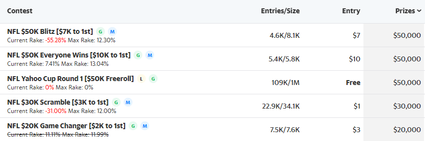

## Install
`npm i`

## Build
`npm run build`

## Add To Chrome
Follow the instructions here https://developer.chrome.com/docs/extensions/mv3/getstarted/#unpacked. When selecting an unpacked folder, choose the public folder.

## Example
